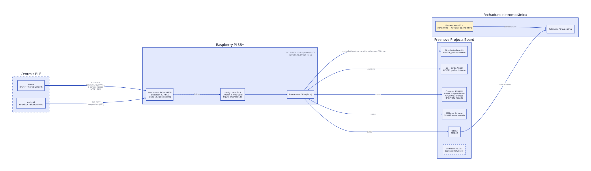
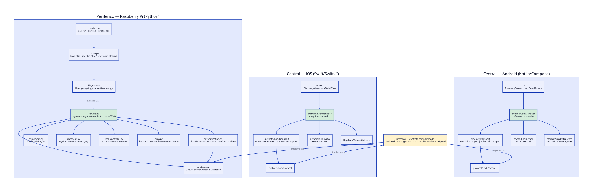
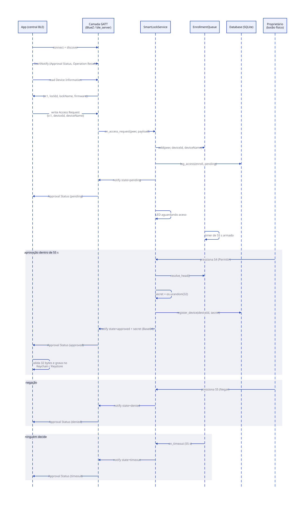
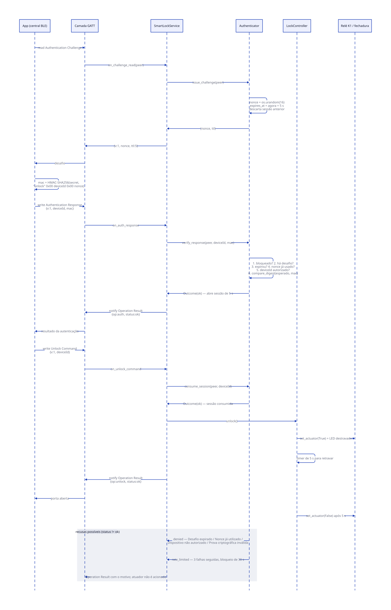
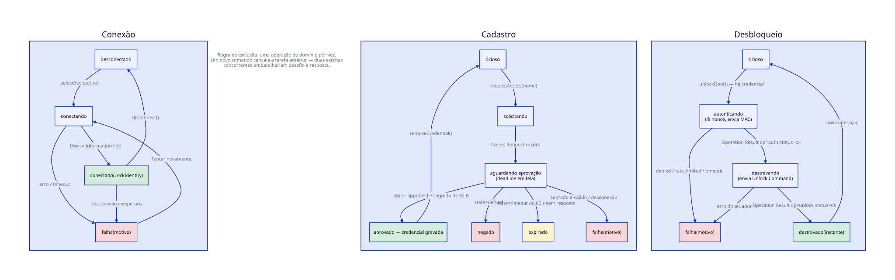

# SmartLock — fechadura eletrônica com autorização por Bluetooth Low Energy

**PCS3732 — Laboratório de Processadores · Escola Politécnica da USP**
**Grupo D — Experimento 1, Aula 11**


Pedro Lins 14603627 
Henrique Krohling 14746867
João Pedro Belga 14747260

Prof. Paulo Cugnasca

11/08/2026

---

## Sumário

1. [Motivação e justificativa](#1-motivação-e-justificativa)
2. [Objetivos](#2-objetivos)
3. [Requisitos funcionais](#3-requisitos-funcionais)
4. [Requisitos não funcionais](#4-requisitos-não-funcionais)
5. [Diagramas da arquitetura](#5-diagramas-da-arquitetura)
6. [Ferramentas utilizadas](#6-ferramentas-utilizadas)
7. [Metodologia de desenvolvimento](#7-metodologia-de-desenvolvimento)
8. [Testes planejados e resultados obtidos](#8-testes-planejados-e-resultados-obtidos)
9. [Conclusões](#9-conclusões)
   [Referências](#referências)

---

## 1. Motivação e justificativa

Fechaduras eletrônicas acionadas por celular deixaram de ser produto de nicho: Nuki, August e
Yale vendem modelos de varejo que substituem a chave física por um aplicativo pareado via
Bluetooth Low Energy (BLE). O apelo é claro — a credencial pode ser concedida, revogada e
auditada remotamente, o que uma chave de metal não permite.

O problema é que a superfície de ataque também muda de natureza. HO *et al.* (2016) auditaram
cinco fechaduras inteligentes comerciais e encontraram, em todas, falhas que iam de revogação
que não revoga a estados que podiam ser forjados pelo celular. ROSE e RAMSEY (2016)
demonstraram, na DEF CON 24, que doze de dezesseis fechaduras BLE testadas cediam a ataques
elementares: senha trafegando em texto claro, repetição de pacote capturado (*replay*) e
comandos aceitos sem qualquer prova de posse da chave. O denominador comum não é criptografia
fraca — é a **ausência** de protocolo de autenticação: o rádio é tratado como se fosse um fio.

Este projeto começou exatamente nesse ponto. A primeira versão desenvolvida pelo grupo, o
`rasp_lock_server.py`, usava Bluetooth clássico (RFCOMM, via a biblioteca `bluedot`) e
**transmitia a chave em texto puro nos dois sentidos** — reproduzindo, sem intenção, a falha
que a literatura já documentava. A reescrita descrita neste relatório trocou transporte e
protocolo ao mesmo tempo, por dois motivos: o aplicativo iOS é uma central BLE e não enxerga
RFCOMM, e um canal sem autenticação não se conserta trocando só a camada de transporte.

A justificativa acadêmica do trabalho está menos na fechadura e mais no que ela obriga a
exercitar: um periférico GATT implementado sobre BlueZ e D-Bus, um protocolo de aplicação
versionado e comum a três implementações independentes (Python, Swift e Kotlin), um esquema
de desafio–resposta com HMAC-SHA256 resistente a repetição, e o acoplamento disso tudo a
GPIO real — botões com *debounce*, LEDs de estado e relé com retravamento temporizado. É um
sistema embarcado pequeno o bastante para caber no semestre e completo o bastante para que as
decisões de projeto tenham consequência observável.

Projetos semelhantes examinados durante o levantamento:

| Projeto | Natureza | O que se aproveitou |
| --- | --- | --- |
| [Nuki Smart Lock](https://nuki.io/) | Comercial | Modelo de concessão e revogação de credenciais por dispositivo |
| [August Smart Lock](https://august.com/) | Comercial | Fluxo de aprovação do proprietário para um novo convidado |
| [ESPHome — componente `lock`](https://esphome.io/components/lock/) | Código aberto | Separação entre lógica de autorização e acionamento do atuador |
| [BlueZ — exemplos GATT em Python](http://www.bluez.org/) | Código aberto | Registro de serviço e anúncio via D-Bus (`example-gatt-server`) |

Nenhum deles resolve o problema central deste trabalho — a distribuição inicial do segredo —
de forma que pudesse ser copiada: os produtos comerciais dependem de um serviço em nuvem, e os
projetos abertos consultados assumem uma rede local confiável. A escolha do grupo foi ancorar
a autorização em um gesto físico (apertar um botão na própria fechadura), discutida na
seção 7 e cujas limitações estão registradas na seção 9.

---

## 2. Objetivos

### 2.1 Objetivo geral

Projetar, implementar e validar uma fechadura eletrônica controlada por Raspberry Pi que
autorize a abertura a partir de aplicativos iOS e Android por Bluetooth Low Energy, usando um
protocolo de aplicação próprio que resista a captura e repetição de mensagens e que vincule o
cadastro de um novo celular à presença física de quem autoriza.

### 2.2 Objetivos específicos

1. **OE1** — Especificar um protocolo GATT versionado, independente de plataforma, com serviço
   e características próprios, mensagens em JSON/UTF-8 e campos binários em Base64,
   documentado de forma a servir de contrato para três implementações independentes.
2. **OE2** — Implementar na Raspberry Pi um periférico BLE sobre BlueZ e D-Bus que exponha
   esse serviço, com o núcleo de regras isolado das bibliotecas de hardware e de comunicação.
3. **OE3** — Implementar um esquema de autenticação por desafio–resposta com HMAC-SHA256, com
   nonce de uso único e validade curta, que impeça a reutilização de uma prova capturada.
4. **OE4** — Vincular o cadastro de um novo celular à aprovação por botão físico na fechadura,
   com sinalização por LED e prazo de decisão.
5. **OE5** — Acionar a fechadura por relé com retravamento automático temporizado, garantindo
   que a porta não permaneça aberta por falha ou queda do serviço.
6. **OE6** — Desenvolver aplicativos iOS (SwiftUI + Core Bluetooth) e Android (Jetpack Compose
   + `BluetoothGatt`) que falem o mesmo protocolo byte a byte, com a credencial armazenada no
   repositório seguro de cada plataforma.
7. **OE7** — Persistir dispositivos cadastrados e registro de acessos em banco local, com
   revogação e consulta por linha de comando.
8. **OE8** — Construir uma suíte de testes automatizados que exercite o protocolo inteiro sem
   depender de rádio, de GPIO ou do relógio de parede, e estabelecer rastreabilidade entre
   requisitos e casos de teste.

---

## 3. Requisitos funcionais

Identificadores no formato **RF-nn**, referenciados pela matriz de rastreabilidade
([`rastreabilidade.md`](rastreabilidade.md)).

| ID | Requisito | Prioridade |
| --- | --- | --- |
| **RF-01** | A fechadura deve anunciar-se por BLE com nome configurável e o UUID do serviço Smart Lock, de modo a ser descoberta por uma central que filtre por esse serviço. | Essencial |
| **RF-02** | A fechadura deve expor um serviço GATT com sete características: Device Information (leitura), Access Request (escrita), Approval Status (notificação), Authentication Challenge (leitura), Authentication Response (escrita), Unlock Command (escrita) e Operation Result (notificação). | Essencial |
| **RF-03** | O aplicativo deve listar as fechaduras ao alcance, ordenadas por intensidade de sinal, e conectar-se à escolhida pelo usuário. | Essencial |
| **RF-04** | Um celular não cadastrado deve poder solicitar acesso informando um identificador próprio e um nome legível. | Essencial |
| **RF-05** | A solicitação de acesso só pode ser aprovada por pressionamento do botão físico *Permitir* na fechadura; nenhum caminho de software pode cadastrar um dispositivo sem esse gesto. | Essencial |
| **RF-06** | Aprovada a solicitação, a fechadura deve gerar um segredo aleatório de 32 bytes, específico daquele celular, persisti-lo e transmiti-lo ao solicitante. | Essencial |
| **RF-07** | O pressionamento do botão *Negar* deve encerrar a solicitação sem cadastrar o dispositivo. | Essencial |
| **RF-08** | Uma solicitação não decidida dentro do prazo configurado (padrão 55 s) deve expirar e ser informada ao aplicativo como `timeout`. | Essencial |
| **RF-09** | O estado da solicitação (pendente, aprovada, negada, expirada) deve ser sinalizado por LEDs na fechadura e notificado ao aplicativo. | Importante |
| **RF-10** | O desbloqueio deve exigir autenticação por desafio–resposta: a central lê um nonce, devolve `HMAC-SHA256(segredo, "unlock" ‖ 0x00 ‖ deviceId ‖ 0x00 ‖ nonce)` e só então envia o comando de abertura. | Essencial |
| **RF-11** | Cada nonce deve ter validade máxima configurável (padrão 5 s) e valer para uma única resposta; uma prova capturada não pode ser reapresentada. | Essencial |
| **RF-12** | Uma autenticação bem-sucedida deve autorizar exatamente um comando de desbloqueio, e apenas para o `deviceId` que se autenticou. | Essencial |
| **RF-13** | Após N tentativas de autenticação inválidas consecutivas (padrão 3), a fechadura deve recusar novas tentativas daquela conexão por um período configurável (padrão 30 s), respondendo `rate_limited`. | Essencial |
| **RF-14** | O comando de desbloqueio aceito deve acionar o atuador e retravá-lo automaticamente após o tempo configurado (padrão 5 s); um novo comando dentro da janela reinicia a contagem em vez de abrir uma segunda janela. | Essencial |
| **RF-15** | O encerramento do serviço, por qualquer via, deve deixar a fechadura travada. | Essencial |
| **RF-16** | Dispositivos cadastrados e o histórico de acessos devem persistir em banco local e sobreviver ao reinício do serviço. | Essencial |
| **RF-17** | Deve existir comando administrativo para listar dispositivos cadastrados, revogar um dispositivo e consultar o registro de acessos. | Importante |
| **RF-18** | Um dispositivo revogado deve ter o desbloqueio recusado mesmo mantendo o segredo em posse. | Essencial |
| **RF-19** | Um novo cadastro do mesmo celular na mesma fechadura deve substituir a credencial anterior, sem acumular registros órfãos, e reabilitar um dispositivo previamente revogado. | Importante |
| **RF-20** | O aplicativo deve armazenar a credencial no repositório seguro da plataforma (Keychain no iOS; `SharedPreferences` cifrado com chave do Android Keystore no Android) e permitir removê-la. | Essencial |
| **RF-21** | Toda mensagem deve declarar a versão do protocolo, e as duas pontas devem recusar versão diferente da suportada. | Essencial |
| **RF-22** | Cada operação relevante (cadastro, autenticação, desbloqueio) deve ser registrada com data, operação, status e motivo, sem jamais registrar segredo, nonce ou MAC. | Importante |

---

## 4. Requisitos não funcionais

| ID | Requisito | Como é atendido |
| --- | --- | --- |
| **RNF-01** — Confidencialidade da chave | O segredo não pode trafegar após o cadastro nem aparecer em log, tela ou mensagem de erro. | Só a notificação `Approval Status` no estado `approved` carrega o segredo; o registro de acesso grava apenas operação, status, motivo, `deviceId` e endereço da central. |
| **RNF-02** — Resistência a repetição | Uma captura do tráfego de desbloqueio não pode ser reproduzida para abrir a porta. | Nonce de 16 bytes de `os.urandom`, validade de 5 s, consumido na verificação e mantido em lista negra até expirar. |
| **RNF-03** — Resistência a análise temporal | A comparação da prova criptográfica não pode vazar informação por tempo de execução. | `hmac.compare_digest` na Raspberry; comparação por XOR acumulado no iOS e no Android. |
| **RNF-04** — Separação de domínio criptográfico | Uma prova válida para uma operação não pode servir para outra. | O contexto `"unlock"` e os separadores `0x00` entram na mensagem autenticada. |
| **RNF-05** — Entropia | Segredos e nonces devem vir de gerador criptograficamente seguro. | `os.urandom` (Raspberry), `SecRandomCopyBytes` (iOS), `SecureRandom` (Android). Segredo de 256 bits; nonce de 128 bits. |
| **RNF-06** — Proteção do repositório de segredos | O banco não pode ser legível por outros usuários do sistema. | `chmod 0600` na criação e `UMask=0077` na unidade *systemd*. |
| **RNF-07** — Latência percebida | O desbloqueio deve concluir em poucos segundos após o toque, sem travar o loop do serviço. | Nenhuma espera bloqueante: toda temporização passa por `GLib.timeout_add`/`idle_add`. Prazo de operação de 8 s no aplicativo. |
| **RNF-08** — Tolerância a falhas de terceiros | Falha do anúncio BLE por defeito de biblioteca não pode impedir o funcionamento. | Contorno automático via `btmgmt` quando `RegisterAdvertisement` falha (seção 7.4); o serviço só encerra se os dois caminhos falharem. |
| **RNF-09** — Segurança em falha | Falha, exceção ou encerramento do serviço não podem deixar a porta destrancada. | `LockController.shutdown()` no bloco `finally`; temporizador de retravamento em *thread* `daemon`; `Restart=on-failure` no *systemd*. |
| **RNF-10** — Ausência de condição de corrida | O estado do serviço não pode ser alterado de dois pontos ao mesmo tempo. | Todo callback externo (botão do `RPi.GPIO`) retorna ao loop GLib por `Scheduler.defer`; banco e controlador protegidos por `RLock`. |
| **RNF-11** — Testabilidade sem hardware | A lógica de protocolo deve ser exercitável sem BLE, sem GPIO e sem esperar tempo real. | `service.py` não importa `dbus` nem `RPi.GPIO`; relógio virtual (`FakeScheduler`) e dublês de GPIO e notificador nos testes. |
| **RNF-12** — Portabilidade de execução | O serviço deve subir em máquina sem hardware, para desenvolvimento. | `--no-gpio` substitui os botões pelo teclado; `create_backend` degrada para `NullGPIO` em `ImportError`/`RuntimeError`. |
| **RNF-13** — Configurabilidade | Pinos, tempos, nomes e caminho do banco devem ser ajustáveis sem alterar código. | 24 variáveis de ambiente com prefixo `SMARTLOCK_`, sobrescritas opcionalmente por argumentos de linha de comando. |
| **RNF-14** — Interoperabilidade entre plataformas | As três implementações devem produzir e aceitar exatamente os mesmos bytes. | Contrato único em `protocol/`; o teste `LockCryptoTest` do Android confere o MAC contra vetor gerado pela Raspberry. |
| **RNF-15** — Compatibilidade de MTU | Mensagens devem caber no MTU negociado, sem truncamento silencioso. | Maior mensagem ≈ 140 B; iOS negocia 185 B automaticamente, Android chama `requestMtu(185)`; escrita maior que o MTU é recusada com erro explícito. |
| **RNF-16** — Manutenibilidade | Alterar uma regra não deve exigir tocar em código de hardware ou de transporte. | Camadas com dependências injetadas (`Notifier`, `Scheduler`, `GPIOBackend` como `Protocol` do PEP 544). |
| **RNF-17** — Observabilidade | Deve ser possível diagnosticar uma recusa sem depurador. | Registro estruturado por operação/status/motivo em SQLite e log em `journalctl`/`stdout` com nível ajustável por `-v`. |
| **RNF-18** — Usabilidade | O usuário deve entender o que está acontecendo em cada etapa. | Estados intermediários visíveis (conectando, aguardando aprovação com contagem regressiva, autenticando, destravando) e mensagens de erro em português, acionáveis. |

---

## 5. Diagramas da arquitetura

As fontes editáveis dos diagramas estão em [`diagramas/`](diagramas/), escritas em
[D2](https://d2lang.com/); as figuras exportadas (SVG e PNG) estão em
[`figuras/`](figuras/). Para regenerar:

```sh
cd docs/diagramas
for f in *.d2; do d2 "$f" "../figuras/${f%.d2}.svg"; done
```

### 5.1 Arquitetura física



A fechadura é uma Raspberry Pi 3B+ montada sobre a *Freenove Projects Board*. O rádio BLE do
controlador BCM4345C0 é gerenciado pelo `bluetoothd` (BlueZ 5.82), com quem o serviço em
Python conversa por D-Bus. Os periféricos da placa ficam em pinos fixos, e a numeração abaixo
é imposta pelo hardware, não escolhida pelo grupo:

| Função | GPIO (BCM) | Elemento na placa |
| --- | --- | --- |
| Botão *Permitir* | 26 | S4 (amarelo), pull-up interno, borda de descida, *debounce* 300 ms |
| Botão *Negar* | 21 | S5 (vermelho) |
| LED aguardando / aprovado / negado | 5 / 6 / 13 | Conector RGB LED (R/G/B) |
| LED destravado | 17 | LED azul soldado na placa |
| Atuador | 12 | Relé K1 |

A placa multiplexa os periféricos em duas chaves DIP: é necessário ligar o bloco *2-Button*
(S3 5–8), *4-Relay* (S2-2) e *5-Blue LED* (S2-3), e manter desligados o *3-Active Buzzer*
(que divide o GPIO12 com o relé), os blocos de LED Matrix, 7-Segment e LED Bar Graph (que
ocupam o GPIO17 por meio de registradores 74HC595) e o *1-Stepping Motor* (que divide pinos
com o conector RGB). Uma fechadura solenoide real exige **fonte de alimentação separada**: o
pico de corrente do acionamento alimentado pelos 3V3 da Pi derruba a placa.

### 5.2 Arquitetura de software — modelagem estática



O contrato em `protocol/` é a raiz do desenho: as três implementações o realizam
independentemente, e não há código compartilhado entre elas. Do lado da Raspberry, a
propriedade que organiza o resto é que **`service.py` não importa `dbus` nem `RPi.GPIO`** —
as regras de negócio dependem apenas de três interfaces (`Notifier`, `Scheduler`,
`GPIOBackend`), declaradas como `Protocol` do PEP 544 e satisfeitas tanto pelas
implementações reais quanto por dublês de teste. É essa inversão que torna o requisito
RNF-11 verificável em vez de aspiracional.

Do lado dos aplicativos, o mesmo desenho aparece duas vezes: um `LockManager` que concentra a
máquina de estados e depende de um `LockTransport` abstrato, com implementação real sobre o
rádio e implementação simulada (`MockLockTransport` no iOS, `FakeLockTransport` no Android)
que reproduz as regras do periférico.

### 5.3 Modelagem comportamental — cadastro



Três detalhes do diagrama merecem destaque, porque são decisões e não consequências:

- A central assina as notificações **antes** de qualquer escrita. A fechadura pode notificar o
  resultado imediatamente após receber o comando, e uma notificação perdida travaria o fluxo.
- A notificação `pending` é informativa e não encerra a espera do aplicativo, que continua
  aguardando um estado terminal.
- O prazo da fechadura (55 s) é deliberadamente menor que o do aplicativo (60 s), para que o
  usuário receba um `timeout` explícito do periférico em vez de estourar o próprio relógio.
  É um acoplamento temporal entre as implementações, registrado em `protocol/state-machine.md`.

### 5.4 Modelagem comportamental — desbloqueio



A ordem de verificação em `Authenticator.verify_response` é significativa: bloqueio por
excesso de tentativas → existência do desafio → expiração → nonce já utilizado → autorização
do dispositivo → comparação do MAC. Apenas os dois últimos incrementam o contador de falhas;
desafio expirado ou nonce repetido não contam, por não constituírem tentativa de adivinhação
da chave.

### 5.5 Modelagem comportamental — estados do aplicativo



O estado observável do aplicativo é o produto de três máquinas ortogonais (conexão, cadastro
e desbloqueio), e não um único enum. A regra que as mantém coerentes é a serialização: uma
operação de domínio por vez, com a anterior cancelada, porque duas escritas concorrentes nas
mesmas características embaralhariam desafio e resposta.

---

## 6. Ferramentas utilizadas

### 6.1 Linguagens

| Linguagem | Versão | Onde |
| --- | --- | --- |
| Python | 3.11+ | Serviço da Raspberry Pi e testes |
| Swift | 5.9 (Xcode 16+) | Aplicativo iOS, alvo mínimo iOS 17 |
| Kotlin | 2.2.10 | Aplicativo Android, `minSdk` 26, `compileSdk` 37 |

### 6.2 Bibliotecas, *frameworks* e ferramentas

| Componente | Uso |
| --- | --- |
| BlueZ 5.82 (`bluetoothd`, `btmgmt`, `btmon`) | Pilha Bluetooth do Linux; registro do serviço GATT e do anúncio |
| `dbus-python`, `PyGObject` (GLib) | Comunicação com o `bluetoothd` e laço de eventos do serviço |
| `RPi.GPIO` | Botões, LEDs e relé |
| `sqlite3`, `hmac`, `hashlib`, `os.urandom` (biblioteca padrão) | Persistência e criptografia — nenhuma dependência externa |
| `unittest` (biblioteca padrão) | Testes automatizados da Raspberry |
| Core Bluetooth, CryptoKit, Security (Keychain), SwiftUI | Aplicativo iOS |
| `BluetoothGatt`, Android Keystore, Jetpack Compose, kotlinx.serialization, kotlinx.coroutines | Aplicativo Android |
| JUnit 4.13.2 + `kotlinx-coroutines-test` | Testes automatizados do Android |
| Gradle 9.x / Android Gradle Plugin 9.3.0 | Construção do aplicativo Android |
| D2 (Terrastruct) | Diagramas deste relatório, versionados como fonte editável |
| Git e GitHub | Versionamento e revisão por *pull request* |

### 6.3 Hardware

| Item | Especificação |
| --- | --- |
| Computador embarcado | Raspberry Pi 3B+ — SoC BCM2837, controlador Bluetooth BCM4345C0, Raspberry Pi OS, kernel 6.18.34+rpt-rpi-v8 |
| Placa de periféricos | Freenove Projects Board for Raspberry Pi (botões S4/S5, conector RGB LED, LED azul, relé K1) |
| Atuador | Relé K1 da placa acionando trava elétrica; fonte externa dedicada |
| Centrais | iPhone com iOS 17+ e aparelho Android com API 26+ (o emulador não possui rádio BLE) |

---

## 7. Metodologia de desenvolvimento

### 7.1 Organização do trabalho

O desenvolvimento foi dividido em fases com fronteiras definidas por artefato entregue, não
por tempo decorrido: (1) protocolo e núcleo do serviço; (2) periférico BLE sobre BlueZ;
(3) aplicativo Android; (4) aplicativo iOS; (5) integração em bancada. Cada fase evoluiu em
ramo próprio (`aula-11-ios-app`, `aula-11-raspberry-ble`), integrado à `main` por *pull
request* — o histórico do repositório registra as revisões (#2 e #3).

### 7.2 Contrato antes das implementações

A decisão metodológica mais consequente foi escrever a especificação do protocolo
(`protocol/uuids.md`, `messages.md`, `state-machine.md`, `security.md`) **antes** das três
implementações, e mantê-la como documento normativo durante todo o desenvolvimento. Três
equipes trabalhando em paralelo, em três linguagens, sem código compartilhado, só convergem se
houver um artefato que sirva de árbitro. Na prática o contrato foi revisado sempre que uma
plataforma revelou uma restrição que as outras não tinham — por exemplo, a negociação de MTU
do Android, que obrigou a documentar o dimensionamento das mensagens.

### 7.3 Especificação executável

Para reduzir o risco de o contrato ser lido e mal-implementado em silêncio, o lado do
periférico foi reimplementado como dublê dentro de cada aplicativo (`MockLockTransport` no
iOS, `FakeLockTransport` no Android). Esses dublês não são apenas simuladores de conveniência:
eles reproduzem as regras de estado — validade e uso único do nonce, autenticação válida para
um único comando, bloqueio após tentativas inválidas — e, portanto, funcionam como
especificação executável. Se o aplicativo violar a ordem do *handshake*, o dublê recusa, e a
falha aparece na interface antes de qualquer contato com hardware. A consequência prática foi
poder desenvolver os dois aplicativos por completo, no simulador, antes de a Raspberry estar
anunciando.

### 7.4 Depuração como parte do método

Um episódio ilustra o procedimento adotado diante de falhas cuja causa não é o próprio código.
O serviço GATT registrava normalmente, mas o anúncio falhava com
`org.bluez.Error.Failed`, e sem anúncio o iOS não enxerga a fechadura. O rastreamento com
`btmon` mostrou que o `bluetoothd` 5.82 usa o caminho MGMT de *extended advertising*
(`Add Ext Adv Params`, `Add Ext Adv Data`) e que o controlador respondia
`Invalid Parameters (0x0d)` a qualquer payload, inclusive vazio; a inspeção das *LE Features*
revelou o bit 12 (*LE Extended Advertising*) em zero, embora o controlador declare HCI
version 9. Ou seja: incompatibilidade entre a pilha e o rádio, não erro do projeto.

O contorno adotado — recorrer ao caminho MGMT legado via `btmgmt add-adv` quando o D-Bus
falha — foi tratado explicitamente como dívida técnica: está isolado em um bloco marcado no
código, documentado no README com sintoma, causa, evidência e **critério objetivo de
remoção**, e coberto por testes automatizados que garantem que o contorno não se torne uma
falha silenciosa.

### 7.5 Convenções de código e de repositório

- Comentários registram o *porquê*, não o *quê*: a razão de o `dataclass Request` usar
  `eq=False`, de o `subprocess.run` receber `input=""`, de o bloqueio sobreviver à reconexão.
- Toda dependência externa ao núcleo é injetada (relógio, gerador aleatório, agendador,
  *backend* de GPIO, notificador), o que dá testabilidade sem `mock` de módulo.
- Documentação junto do código: cada subprojeto tem README com instalação, execução, pinagem
  e diagnóstico de falhas conhecidas.
- Commits incrementais e descritivos, com prefixo da aula ou do subsistema.

---

## 8. Testes planejados e resultados obtidos

### 8.1 Estratégia de validação

A validação está organizada em três níveis, escolhidos pelo que cada um consegue provar:

1. **Testes automatizados sem hardware** — exercitam o protocolo e as regras de autorização com
   dublês para BLE, GPIO e relógio. Rodam em qualquer máquina, em menos de um segundo, e são o
   mecanismo de regressão do projeto.
2. **Testes manuais no simulador** — o aplicativo iOS roda contra o `MockLockTransport`,
   percorrendo cadastro, negação, expiração, desbloqueio e revogação sem rádio.
3. **Ensaios de bancada** — cenários que dependem de rádio, hardware e tempo real, executados
   com a Raspberry montada na Freenove Projects Board.

A matriz completa requisito ↔ caso de teste está em
[`rastreabilidade.md`](rastreabilidade.md). O resumo por nível:

| Nível | Casos | Situação |
| --- | --- | --- |
| Automatizados — Raspberry (`unittest`) | 15 | Executados; 15 aprovados |
| Automatizados — Android (JUnit) | 37 | Executados; ver 8.3 |
| Automatizados — iOS | 0 | Alvo de testes ainda não criado no projeto Xcode |
| Bancada (manuais) | 12 planejados | Executados |

### 8.2 Resultados — Raspberry Pi

Comando e saída completa em
[`evidencias/testes-raspberry.txt`](evidencias/testes-raspberry.txt).

```
$ cd src/raspberry && python3 -m unittest discover -s tests -t . -v
...
Ran 15 tests in 0.059s

OK
```

Os sete casos de `test_service.py` cobrem o caminho feliz completo (cadastro aprovado →
desafio → resposta válida → atuador acionado) e as recusas de maior consequência: dispositivo
desconhecido, botão *Negar*, nonce expirado, reutilização de uma autenticação já consumida,
dispositivo revogado e persistência através de reinício. Os oito casos de `test_runner.py`
cobrem o contorno de anúncio: extração do índice do adaptador, montagem da linha de comando,
detecção de falha do MGMT que o `btmgmt` reporta com código de saída zero, ausência do
binário, remoção da instância e o encadeamento D-Bus → contorno → encerramento.

O tempo é virtual: `FakeScheduler` mantém um relógio que só avança quando o teste manda, o que
permite verificar a expiração do nonce sem esperar cinco segundos e torna a suíte determinística.

### 8.3 Resultados — Android

`./gradlew test` executa 37 casos em três classes:

- **`LockCryptoTest`** (8 casos) — confere o HMAC contra vetor gerado pela própria Raspberry,
  em Base64 e em hexadecimal, e verifica separação de contexto, efeito dos separadores `0x00`,
  variação por nonce e comparação em tempo constante. É o teste que garante a
  interoperabilidade byte a byte: se ele quebrar, o desbloqueio quebrou.
- **`LockCodecTest`** (14 casos) — cada mensagem do protocolo, incluindo recusa de versão
  divergente, tolerância a campo desconhecido, payload inválido e o caso do `Approval Status`
  truncado por MTU insuficiente.
- **`LockManagerTest`** (15 casos) — cadastro aprovado, negado e expirado; reaproveitamento do
  `deviceId` no recadastro; segredo de tamanho inválido recusado; desbloqueio feliz;
  autenticação negada; bloqueio temporário; falha do atuador; remoção de credencial; falha e
  queda de conexão; recarga das credenciais salvas.


### 8.4 Lacuna conhecida — iOS

O projeto Xcode não possui alvo de testes, de modo que `xcodebuild test` não tem o que
executar. A lacuna é tanto mais notável porque a arquitetura foi construída para ser testada:
`LockTransport` e `CredentialStoring` são protocolos injetados no construtor do `LockManager`,
`InMemoryCredentialStore` já existe para os *previews*, e os estados são `Equatable`. A
criação do alvo e a portabilidade dos casos do `LockManagerTest` do Android estão registradas
como trabalho futuro (seção 9).

### 8.5 Ensaios de bancada planejados

| ID | Cenário | Critério de aceitação | Resultado |
| --- | --- | --- | --- |
| **TB-01** | Descoberta e conexão a partir do iPhone | A fechadura aparece como `SmartLock-Sala` e a conexão expõe as sete características | Sucesso |
| **TB-02** | Cadastro aprovado por botão físico | LED aguardando acende; ao pressionar S4 o app recebe o segredo e grava a credencial | Sucesso |
| **TB-03** | Cadastro negado | Pressionar S5 encerra a solicitação sem cadastrar | Sucesso |
| **TB-04** | Expiração do cadastro | Sem decisão em 55 s, o app exibe expiração | Sucesso |
| **TB-05** | Desbloqueio autorizado | Relé aciona, LED azul acende, retravamento após 5 s | Sucesso |
| **TB-06** | Bloqueio por tentativas inválidas | Três respostas inválidas levam a `rate_limited` por 30 s | Sucesso |
| **TB-07** | Revogação | `python3 -m smartlock revoke <id>` impede o desbloqueio do aparelho revogado | Sucesso |
| **TB-08** | Reinício do serviço | Dispositivos cadastrados sobrevivem; a porta permanece travada durante o reinício | Sucesso |
| **TB-09** | Dois celulares simultâneos | Cada central recebe apenas o desfecho da própria solicitação | Sucesso |
| **TB-10** | Bluetooth desligado no meio da operação | O app reporta falha de forma legível, sem travar | Sucesso |
| **TB-11** | Paridade Android × iOS | O mesmo fluxo produz o mesmo resultado nas duas plataformas | Sucesso |
| **TB-12** | Interoperabilidade do MTU | O `Approval Status` aprovado chega íntegro no Android após `requestMtu(185)` | Sucesso |

Sugere-se registrar as evidências em `docs/evidencias/` — fotografia ou vídeo curto do
acionamento, trecho do log do serviço (`journalctl -u smartlock`) e captura de tela do
aplicativo — nomeadas pelo identificador do ensaio.

---

## 9. Conclusões

### 9.1 Objetivos cumpridos

Dos oito objetivos específicos, sete estão cumpridos e verificáveis no repositório: o
protocolo versionado e documentado (OE1), o periférico BLE com núcleo isolado (OE2), o
desafio–resposta com nonce de uso único (OE3), a aprovação por botão físico (OE4), o
acionamento com retravamento e travamento na saída (OE5), os dois aplicativos falando o mesmo
protocolo (OE6) e a persistência com revogação e administração por linha de comando (OE7).
O oitavo (OE8) está parcialmente cumprido: a suíte automatizada existe e é substancial do lado
da Raspberry e do Android — 52 casos ao todo, todos independentes de rádio e de relógio real —
mas o aplicativo iOS não tem nenhum teste automatizado.

Quanto aos requisitos, os 22 funcionais estão implementados. Entre os não funcionais, o que
não se sustenta integralmente é o **RNF-01**: o segredo não trafega depois do cadastro, mas o
*instante* do cadastro tem exposição real, discutida a seguir.

### 9.2 Limitações reconhecidas

1. **A distribuição do segredo é o elo frágil.** O BlueZ não endereça notificação a uma central
   específica: no momento da aprovação, o `Approval Status` com o segredo vai para todas as
   centrais inscritas. A janela é estreita — exige um atacante já conectado e inscrito no
   instante em que alguém aperta o botão — mas é real, e é exatamente a classe de falha que
   ROSE e RAMSEY (2016) documentaram nos produtos comerciais. Duas mitigações estão
   disponíveis: exigir emparelhamento com link criptografado
   (`SMARTLOCK_REQUIRE_ENCRYPTION=1`, hoje desligado por conveniência de bancada) e, como
   solução de raiz, trocar a difusão do segredo por criptografia assimétrica, com o celular
   gerando o par de chaves e enviando apenas a pública.
2. **A fechadura não se autentica perante o celular.** Um periférico falso que anuncie o mesmo
   UUID coleta solicitações de acesso e engana o usuário, embora não obtenha segredo. Assinar
   o `Device Information` com uma chave da fechadura resolveria.
3. **O bloqueio por tentativas é por conexão, não global.** Um atacante que randomize o
   endereço BLE a cada tentativa contorna o contador. O limite eficaz teria de ser uma taxa
   máxima por minuto na fechadura inteira.
4. **O segredo fica em claro no SQLite**, consequência inerente do HMAC simétrico: quem tiver
   `root` na Raspberry tem as credenciais.
5. **O desbloqueio exige o aplicativo aberto** nas duas plataformas — não há execução em
   segundo plano nem reconexão automática.

### 9.3 Dificuldades encontradas

A dificuldade mais custosa não foi conceitual. Foi diagnosticar que a falha do anúncio BLE
vinha de uma incompatibilidade entre o `bluetoothd` 5.82 e o controlador BCM4345C0, que declara
suporte a Bluetooth 5.0 mas não implementa *extended advertising*. Chegar a essa conclusão
exigiu descer do D-Bus ao MGMT e ao HCI com `btmon` e ler os bits de *LE Features* — trabalho
que não produz linha de código de funcionalidade e que, sem instrumentação, é indistinguível de
um erro do próprio projeto.

As demais dificuldades relevantes: a decisão de trocar RFCOMM por BLE, que invalidou a primeira
implementação inteira e obrigou a reescrever transporte e protocolo juntos; e as diferenças de
plataforma entre iOS e Android — negociação de MTU, serialização das operações GATT, escrita
explícita do descritor CCCD e ausência de Keychain no Android — que não são escolhas de estilo,
mas imposições que precisaram ser absorvidas sem divergir do protocolo.

### 9.4 Lições aprendidas

- **Escrever o contrato antes das implementações foi o que permitiu o paralelismo.** Três
  linguagens, sem código compartilhado, convergiram porque havia um documento normativo e um
  vetor de teste comum.
- **Um dublê que implementa as regras vale mais do que um simulador que só devolve sucesso.**
  Os aplicativos ficaram prontos antes do hardware porque o dublê recusava o que a fechadura
  recusaria.
- **Isolar o núcleo das bibliotecas de plataforma é o que torna o teste possível.** A regra de
  `service.py` não importar `dbus` nem `RPi.GPIO` parece ascetismo até o momento em que se
  quer rodar a suíte inteira em um notebook.
- **Contorno de bug de terceiro precisa de critério de remoção escrito no dia em que é
  adotado.** Sem isso, ele vira parte permanente do sistema.

### 9.5 Trabalhos futuros

1. Substituir a difusão do segredo por troca de chaves assimétrica (elimina a limitação 9.2.1).
2. Criar o alvo de testes do iOS e portar os casos do `LockManagerTest` do Android.
3. Assinar o `Device Information` para autenticar a fechadura perante o celular.
4. Implementar limite global de tentativas por minuto, complementando o bloqueio por conexão.
5. Habilitar `REQUIRE_ENCRYPTION` por padrão após validar o emparelhamento em bancada.
6. Adicionar execução em segundo plano e reconexão automática nos aplicativos.
7. Consumir o sensor de porta já previsto na configuração, para registrar abertura efetiva.
8. Remover o contorno do `btmgmt` quando a combinação kernel/BlueZ for corrigida, seguindo o
   critério documentado no README.

---

## Referências

BLUETOOTH SIG. **Bluetooth Core Specification**: version 5.3. Kirkland: Bluetooth Special
Interest Group, 2021. Disponível em: https://www.bluetooth.com/specifications/specs/. Acesso
em: 11 ago. 2026.

BLUEZ PROJECT. **BlueZ**: official Linux Bluetooth protocol stack. 2026. Disponível em:
http://www.bluez.org/. Acesso em: 11 ago. 2026.

HO, G.; LEUNG, D.; MISHRA, P.; HOSSEINI, A.; SONG, D.; WAGNER, D. Smart locks: lessons for
securing commodity Internet of Things devices. In: ACM ASIA CONFERENCE ON COMPUTER AND
COMMUNICATIONS SECURITY, 11., 2016, Xi'an. **Proceedings** [...]. New York: ACM, 2016.
p. 461-472.

KRAWCZYK, H.; BELLARE, M.; CANETTI, R. **RFC 2104**: HMAC — keyed-hashing for message
authentication. [S. l.]: Internet Engineering Task Force, 1997. Disponível em:
https://www.rfc-editor.org/rfc/rfc2104. Acesso em: 11 ago. 2026.

NATIONAL INSTITUTE OF STANDARDS AND TECHNOLOGY. **FIPS PUB 180-4**: secure hash standard
(SHS). Gaithersburg: NIST, 2015.

NATIONAL INSTITUTE OF STANDARDS AND TECHNOLOGY. **FIPS PUB 198-1**: the keyed-hash message
authentication code (HMAC). Gaithersburg: NIST, 2008.

ROSE, A.; RAMSEY, B. **Picking Bluetooth Low Energy locks from a quarter mile away**. In:
DEF CON, 24., 2016, Las Vegas. Las Vegas: DEF CON, 2016.

SOMMERVILLE, I. **Engenharia de software**. 10. ed. São Paulo: Pearson, 2018.

TERRASTRUCT. **D2**: declarative diagramming. 2026. Disponível em: https://d2lang.com/.
Acesso em: 11 ago. 2026.

---

*Documento redigido em Markdown para conversão posterior a LaTeX (Overleaf). Os diagramas em
`docs/diagramas/` são a fonte editável; as figuras em `docs/figuras/` são geradas a partir
deles e não devem ser editadas à mão.*
